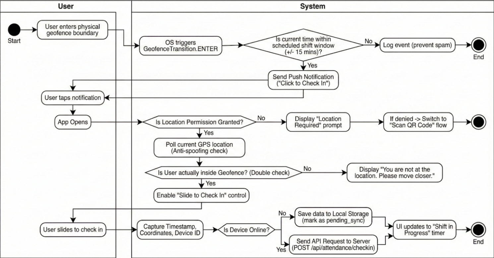

## 10. Activity Diagram: Geofenced Check-In Flow

The following logic flow describes the **Geofenced Check-in process**, handling the complexities of permission states and connectivity.

1. **Start Node:** User enters the physical geofence boundary.
2. **System Event:** OS triggers `GeofenceTransition.ENTER`.
3. **Decision:** Is the current time within the scheduled **shift window** (+/- 15 mins)?
    * **No:** Log event but take no action (prevent spam). **End.**
    * **Yes:** Proceed.
4. **Action:** System sends **Push Notification** ("Click to Check In").
5. **User Action:** User taps notification -> **App Opens**.
6. **Decision:** Is **Location Permission** Granted?
    * **No:** Display "Location Required" prompt. If denied -> Switch to **"Scan QR Code"** flow.
    * **Yes:** Proceed.
7. **Action:** Poll current GPS location to confirm (**Anti-spoofing check**).
8. **Decision:** Is the user actually **inside Geofence**? (Double check).
    * **No:** Display "You are not at the location. Please move closer."
    * **Yes:** Enable **"Slide to Check In"** control.
9. **User Action:** User slides to check in.
10. **Action:** Capture **Timestamp**, **Coordinates**, and **Device ID**.
11. **Decision:** Is Device **Online**?
    * **No:** Save data to **Local Storage** (mark as `pending_sync`).
    * **Yes:** Send API Request to Server (`POST /api/attendance/checkin`).
12. **Action:** Server validates request and updates database.
13. **End Node:** UI updates to **"Shift in Progress"** timer.